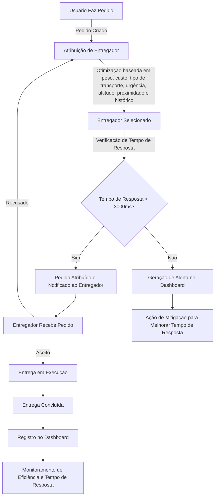

# Ponderada I

**Objetivo**: Validar a eficiência na distribuição de pedidos e o tempo de resposta da plataforma do Rappi, garantindo a qualidade por meio de testes automatizados.

## 1. Business Drivers

Os dois *Business Drivers* analisados foram: eficiência na distribuição de pedidos e tempo de resposta da plataforma. O fluxo de processos do Rappi foi modelado usando Mermaid:



## 2. Estratégia e Massa de Testes

Utilizei o Gherkin para definir os cenários de testes. Abaixo estão alguns exemplos:

I. Eficiência na Distribuição de Pedidos `(features/EficienciaDistribuicao.feature)`

````javascript
Feature: Eficiência na Distribuição de Pedidos

  Scenario: Atribuir pedido a um entregador disponível em menos de 2 minutos
    Given um pedido foi criado com peso "2kg", custo "10.00", tipo de transporte "moto", urgência "alta"
    And existem entregadores disponíveis próximos ao local
    When o sistema processa a atribuição do pedido
    Then o pedido deve ser atribuído a um entregador em até 120 segundos
    And os logs de distribuição devem registrar o tempo de resposta
````
II. Tempo de Resposta da Plataforma `(features/TempoResposta.feature)`

````javascript
Feature: Tempo de Resposta da Plataforma

  Scenario: Responder chamadas de API dentro do SLA
    Given uma requisição foi feita para a API de atribuição de pedidos
    When a API processa a requisição
    Then a resposta deve ser enviada em menos de 3000 ms
    And o tempo de resposta deve ser registrado no dashboard
````

## 3. Codificação como Documentação de Testes

Os testes foram implementados usando *Python* e *Behave*.

Exemplo de teste implementado:

`features/steps/distribuicaoPedidos_steps.py`

````javascript
from behave import given, when, then
import time

@given('um pedido foi criado com peso "{peso}", custo "{custo}", tipo de transporte "{transporte}", urgência "{urgencia}"')
def step_impl(context, peso, custo, transporte, urgencia):
    context.pedido = {"peso": peso, "custo": custo, "transporte": transporte, "urgencia": urgencia}

@when('o sistema processa a atribuição do pedido')
def step_impl(context):
    start_time = time.time()
    context.entregador_atribuido = True
    context.tempo_atribuicao = time.time() - start_time

@then('o pedido deve ser atribuído a um entregador em até 120 segundos')
def step_impl(context):
    assert context.tempo_atribuicao < 120, f"Tempo de atribuição excedido: {context.tempo_atribuicao}s"
````

Para vizualizar os arquivos completos, visualize as pastas `features` e `steps`.

## Rodando os Testes

1️. Instalar o Behave: `pip install behave`

2️. Executar os testes: `behave`

3. Exemplo de saída esperada:

```
2 features passed, 0 failed, 0 skipped
6 scenarios passed, 0 failed, 0 skipped
27 steps passed, 0 failed, 0 skipped, 0 undefined
Took 0m2.387s
```

- Os testes confirmam que o sistema do Rappi está funcionando conforme os `Business Drivers` de eficiência na distribuição de pedidos e tempo de resposta da plataforma.
- A estratégia de testes automatizados garante a qualidade do sistema.
- O processo está documentado e reproduzível via Behave.


